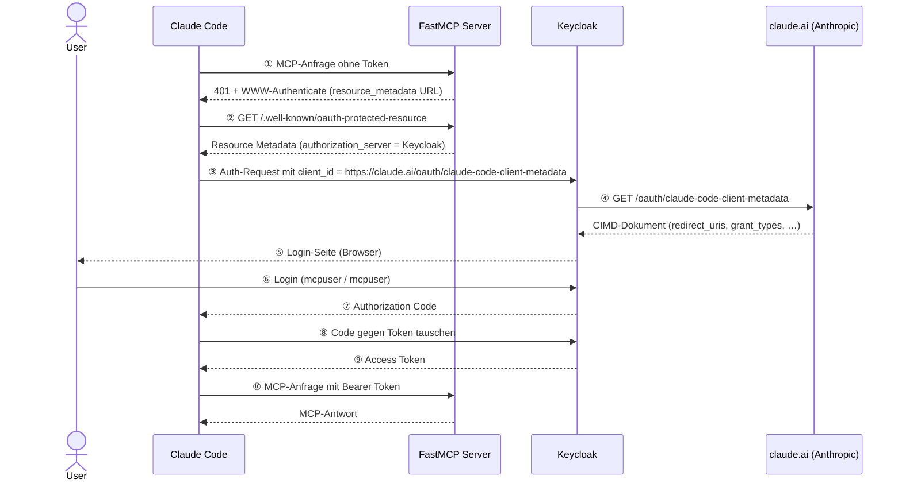
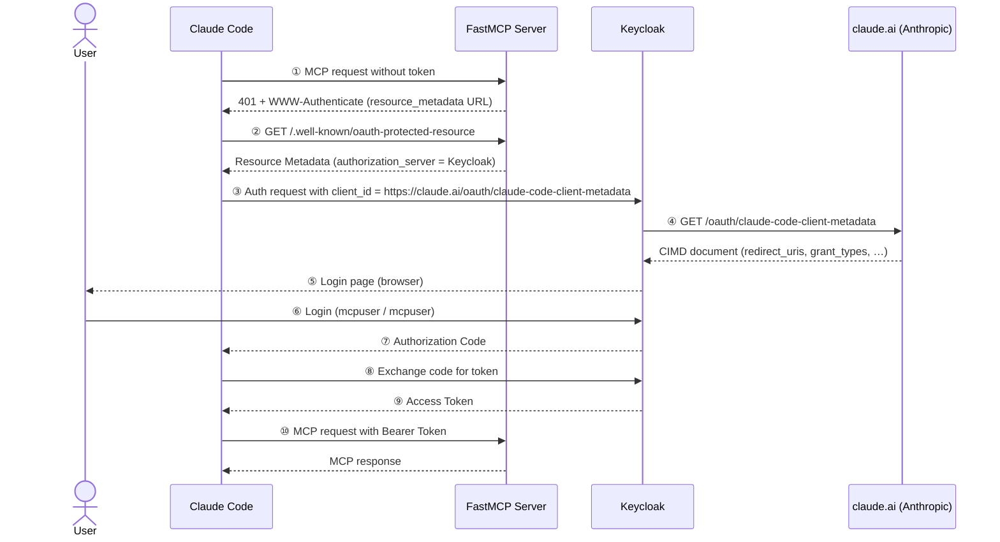

# CIMD — Client ID Metadata Document

## DE

### Überblick

Dieses Demo zeigt, wie ein MCP-Client (Claude Code) sich bei einem MCP-Server authentifiziert, wobei **Keycloak** als Authorization Server fungiert und das **Client ID Metadata Document (CIMD)**-Verfahren genutzt wird.

Bei CIMD ist die `client_id` keine einfache Zeichenkette, sondern eine **HTTPS-URL** — in diesem Fall `https://claude.ai/oauth/claude-code-client-metadata`. Keycloak ruft diese URL selbst ab, um die Metadaten des Clients zu lesen, anstatt auf eine vorherige Registrierung angewiesen zu sein.



### Start

```bash
docker compose up
```

Warte bis Keycloak vollständig gestartet ist (`Listening on: http://0.0.0.0:8080`).

Keycloak Admin Console: http://localhost:8080 (admin / admin)
Realm: `mcp-demo`, Testnutzer: `mcpuser` / `mcpuser`

### MCP-Server mit Claude Code verbinden

```bash
claude mcp add --transport http cimd-demo http://localhost:8000/mcp
```

Claude Code erkennt automatisch, dass der Server OAuth verlangt, führt den CIMD-Authentifizierungsfluss durch und öffnet einen Browser für den Login.

### Was zu sehen ist

1. **Realm Settings → Client Policies**: Die Policy `cimd-policy` mit dem Executor `client-id-metadata-document`
2. **Clients**: Nach dem ersten Login erscheint Claude Code als Client mit der URL als `client_id`
3. **Events**: Im Admin-Bereich die OAuth-Events beobachten

### Keycloak-Besonderheiten

- Feature-Flag `--features=cimd` ist erforderlich (in `docker-compose.yaml` gesetzt)
- Das Feature ist experimentell (Stand Keycloak 26.6.x)
- `allow-http-scheme: true` erlaubt HTTP für lokale Demos; in Produktion deaktivieren
- `restrict-same-domain: false` ist nötig, da Claude Code `localhost` als Redirect-URI nutzt

---

## EN

### Overview

This demo shows how an MCP client (Claude Code) authenticates to an MCP server, with **Keycloak** acting as the authorization server using **Client ID Metadata Document (CIMD)**.

In CIMD, the `client_id` is not a plain string but an **HTTPS URL** — in this case `https://claude.ai/oauth/claude-code-client-metadata`. Keycloak fetches that URL itself to read the client's metadata, instead of relying on prior registration.



### Start

```bash
docker compose up
```

Wait until Keycloak is fully started (`Listening on: http://0.0.0.0:8080`).

Keycloak Admin Console: http://localhost:8080 (admin / admin)
Realm: `mcp-demo`, test user: `mcpuser` / `mcpuser`

### Connect the MCP server to Claude Code

```bash
claude mcp add --transport http cimd-demo http://localhost:8000/mcp
```

Claude Code will automatically detect that the server requires OAuth, execute the CIMD authentication flow, and open a browser for login.

### What to observe

1. **Realm Settings → Client Policies**: The `cimd-policy` with the `client-id-metadata-document` executor
2. **Clients**: After the first login, Claude Code appears as a client with the URL as `client_id`
3. **Events**: Watch OAuth events in the admin area

### Keycloak specifics

- Feature flag `--features=cimd` is required (set in `docker-compose.yaml`)
- The feature is experimental (as of Keycloak 26.6.x)
- `allow-http-scheme: true` allows HTTP for local demos; disable in production
- `restrict-same-domain: false` is needed because Claude Code uses `localhost` as redirect URI

### The CIMD document hosted by Anthropic

```bash
curl https://claude.ai/oauth/claude-code-client-metadata
```

```json
{
  "client_id": "https://claude.ai/oauth/claude-code-client-metadata",
  "client_name": "Claude Code",
  "redirect_uris": ["http://localhost/callback", "http://127.0.0.1/callback"],
  "grant_types": ["authorization_code", "refresh_token"],
  "token_endpoint_auth_method": "none"
}
```

This is the URL Keycloak fetches when Claude Code presents it as `client_id`.

### MCP server tools

The FastMCP server exposes three tools:

| Tool | Description |
|---|---|
| `get_greeting` | Returns a personalized greeting confirming authentication |
| `list_demo_topics` | Lists the topics covered in this demo |
| `explain_cimd` | Returns a structured explanation of the CIMD flow |
