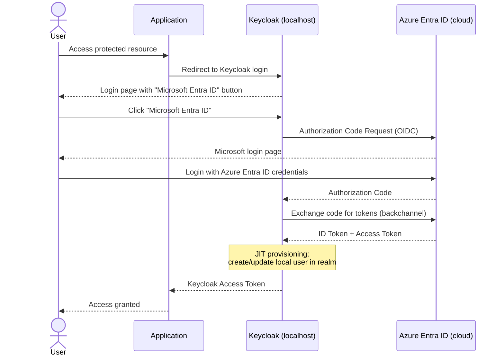

# Azure Entra ID Integration with Keycloak - Demo

This Terraform project creates a minimal Azure Entra ID (formerly Azure Active Directory) setup for integrating with a locally running Keycloak instance as an Identity Provider.

## Prerequisites

- **Azure Subscription**: An active Azure subscription
- **Azure CLI**: Installed and configured ([Installation Guide](https://docs.microsoft.com/en-us/cli/azure/install-azure-cli))
- **Terraform**: Version 1.0 or higher ([Download](https://www.terraform.io/downloads))
- **Keycloak**: Running locally on port 8080 (see parent labs for setup)
- **Azure AD Permissions**: Application Developer role or higher (see [PERMISSIONS.md](PERMISSIONS.md) for details)

## What This Demo Creates

This Terraform configuration provisions:

1. **Azure AD Application Registration** - Configured as an OpenID Connect provider
2. **Service Principal** - Enterprise application for the registration
3. **Client Secret** - For authenticating Keycloak to Azure AD
5. **API Permissions** - Required Microsoft Graph permissions for user profile access

## Setup Instructions

### 1. Authenticate to Azure

```bash
# Login to Azure
az login

# Verify your subscription
az account show

# (Optional) Set a specific subscription if you have multiple
az account set --subscription "YOUR_SUBSCRIPTION_ID"
```

### 2. Initialize Terraform

```bash
cd keycloak/masterclass/demos/entra-id

# Initialize Terraform providers
terraform init
```

### 3. Review the Plan

```bash
# See what will be created
terraform plan
```

### 4. Apply the Configuration

```bash
# Create the Azure resources
terraform apply
```

Review the planned changes and type `yes` to confirm.

### 5. Retrieve Configuration Values

After successful deployment, retrieve the values needed for Keycloak:

```bash
# Get Client ID
terraform output application_client_id

# Get Client Secret (sensitive)
terraform output -raw application_client_secret

# Get Tenant ID
terraform output tenant_id

# Get all endpoints
terraform output authorization_endpoint
terraform output token_endpoint
terraform output issuer

# Or see the full configuration guide
terraform output -raw keycloak_configuration_guide
```

## Configuring Keycloak

### Step 1: Add Azure AD as Identity Provider

1. Open Keycloak Admin Console: http://localhost:8080
2. Login with `admin` / `admin`
3. Select your realm (e.g., `labrealm` or create a new one)
4. Navigate to: **Identity Providers** > **Add provider** > **OpenID Connect v1.0**

### Step 2: Configure Provider Settings

Use the values from Terraform outputs:

| Field | Value                                                  |
|-------|--------------------------------------------------------|
| **Alias** | `azure`                                                |
| **Display Name** | `Microsoft Entra ID`                                   |
| **Authorization URL** | From `terraform output authorization_endpoint`         |
| **Token URL** | From `terraform output token_endpoint`                 |
| **Client ID** | From `terraform output application_client_id`          |
| **Client Secret** | From `terraform output -raw application_client_secret` |
| **Issuer** | From `terraform output issuer`                         |
| **Scopes** | `openid profile email`                                 |

> **Careful — this is the most common mistake in this demo.** The **Scopes** field lives in the
> collapsed **Advanced settings** section, so it is easy to miss. If you leave it empty, Keycloak
> requests `scope=openid` only. Entra ID then returns an ID token containing nothing but
> `sub`/`oid`/`tid` — no `preferred_username`, `name`, `given_name`, `family_name` or `email` — and
> every login ends on Keycloak's *Update Account Information* page.
>
> You can verify what Keycloak actually sends by clicking the provider button on the login page and
> inspecting the `scope` parameter of the redirect to `login.microsoftonline.com`.

### Step 3: Grant Admin Consent (Required)

The Entra ID application requires admin consent to access user profile information:

1. Go to [Azure Portal](https://portal.azure.com)
2. Navigate to: **App registrations** > **Keycloak Identity Broker-XXXXXX**
3. Click: **API permissions** > **Grant admin consent for [Your Directory]**
4. Confirm the consent

### Step 4: Check Which Attributes Actually Arrive

Requesting a scope does not guarantee that Entra ID has a value to put in the claim. This matters
most for `email`:

- `given_name` / `family_name` come from the user's *Given name* / *Surname* in the directory.
- `preferred_username` carries the UPN.
- **`email` is sourced exclusively from the user's `mail` attribute.** For cloud-only users without
  an Exchange license — which is what you get in a fresh demo or sandbox tenant — `mail` is `null`,
  so no `email` claim is issued. The `optional_claims` block in `main.tf` requests the claim, but a
  requested claim without a directory value stays absent.

Check the user in your tenant:

```bash
az ad user show --id <upn> \
  --query '{upn:userPrincipalName, mail:mail, given:givenName, sur:surname}'
```

Since `email`, `firstName` and `lastName` are required attributes of the default user profile,
a missing `email` claim alone is enough to trigger *Update Account Information* on every first login.

If `mail` is empty and you cannot set it (no permissions, or no mailbox on the account), map the UPN
onto the email attribute in Keycloak instead — **Identity Providers > azure > Mappers > Add mapper**:

| Field | Value |
|-------|-------|
| **Name** | `email-from-upn` |
| **Sync mode override** | `Inherit` |
| **Mapper type** | `Attribute Importer` |
| **Claim** | `preferred_username` |
| **User Attribute Name** | `email` |

Then set **Trust Email = On** on the identity provider — this realm has no SMTP server configured,
so without it the user gets stuck on *Verify email*.

This step is worth doing live in the workshop: it is the clearest illustration of why brokered
attribute mapping has to be verified rather than assumed.

### Step 5: Test the Integration

1. In Keycloak, open the account console of the realm: http://localhost:8080/realms/labrealm/account
2. On the login page, click **Microsoft Entra ID**
3. Sign in with your Entra ID account
4. You are redirected back to Keycloak, which provisions the user just in time (JIT) and lands you
   in the account console — **without** an *Update Account Information* page

If that page still shows up, see the troubleshooting section below. Note that the user is only
provisioned once: to test a changed mapping, delete the user in **Users** first, otherwise
`first broker login` is skipped on the next sign-in.

## Architecture Overview



## Customization

### Change Redirect URIs

Edit `main.tf` and modify the `web.redirect_uris` block:

```hcl
web {
  redirect_uris = [
    "http://localhost:8080/realms/YOUR_REALM/broker/azure/endpoint",
  ]
}
```

### Adjust Token Lifetime

Modify the secret expiration in `main.tf`:

```hcl
resource "azuread_application_password" "keycloak" {
  # Change from 2 years to your preferred duration
  end_date = timeadd(timestamp(), "8760h") # 1 year
}
```

## Cleanup

To remove all Azure resources created by this demo:

```bash
terraform destroy
```

Type `yes` to confirm deletion.

## Troubleshooting

### Issue: "AADSTS700016: Application not found"

**Solution**: Ensure you've granted admin consent in Azure Portal (Step 3 above).

### Issue: "Invalid redirect_uri"

**Solution**: Verify that the redirect URI in Keycloak matches exactly what's configured in Azure AD. The realm name is case-sensitive.

### Issue: "Client authentication failed"

**Solution**: Double-check that you're using the correct client secret from `terraform output -raw application_client_secret`.

### Issue: Keycloak shows "Update Account Information" after returning from Entra ID

Keycloak's `first broker login` flow runs the **Review Profile** authenticator with
`Update Profile on First Login = missing`, so this page appears whenever a required user-profile
attribute could not be filled from the token. Work through it in this order:

1. **Are the scopes set?** Identity provider > *Advanced settings* > **Scopes** must contain
   `profile email` (see Step 2). Empty means `scope=openid` only, and then *all* fields are missing.
2. **Which field is still empty?** The pre-filled fields on the page tell you exactly which claims
   arrived. Username and first/last name filled but email empty is the `mail`-is-null case from
   Step 4 — fix it with the `email-from-upn` mapper.
3. **Delete the already-provisioned user** in the realm before re-testing. Once a user is linked to
   the provider, `first broker login` no longer runs and you will not see your change take effect.

## Security Notes

- **Client Secret**: The client secret is sensitive. In production, store it securely (e.g., Azure Key Vault, Keycloak vault)
- **Redirect URIs**: Localhost URIs are only for development. Use HTTPS URLs in production
- **Token Lifetime**: Secrets expire after 2 years by default. Set up rotation before expiration

## Additional Resources

- [Keycloak Identity Brokering Documentation](https://www.keycloak.org/docs/latest/server_admin/#_identity_broker)
- [Azure AD OpenID Connect](https://docs.microsoft.com/en-us/azure/active-directory/develop/v2-protocols-oidc)
- [Microsoft Graph Permissions Reference](https://docs.microsoft.com/en-us/graph/permissions-reference)

## Support

This is demo/training material. For Keycloak masterclass support, contact your codecentric instructor.
