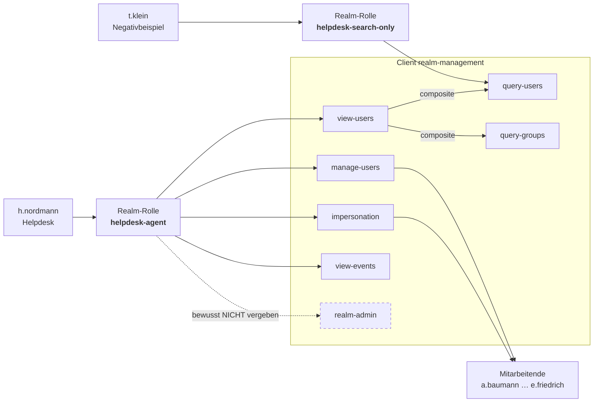

# Demo: Delegierte Benutzerverwaltung mit Corporate Design

## DE

### Szenario

Die **Nordlicht Energie AG** betreibt einen internen Helpdesk. Der soll Passwörter zurücksetzen,
gesperrte Konten entsperren und neue Mitarbeitende anlegen können — aber ausdrücklich **kein
Realm-Admin** sein. Kein Zugriff auf Clients, keine Authentication Flows, keine Realm-Einstellungen.

Zusätzlich soll der Helpdesk nicht in einer generischen Keycloak-Oberfläche arbeiten, sondern im
Corporate Design des Hauses — Login **und** Admin-Console.

Beides ist in dieser Demo fertig konfiguriert. Es muss nichts geklickt werden.

### Umgebung starten

```bash
docker compose up
```

| Was | URL | Zugang |
|---|---|---|
| Realm-Admin-Console (die Demo) | http://localhost:8080/admin/helpdesk/console/ | `h.nordmann` / `helpdesk` |
| Dieselbe Console, Negativbeispiel | http://localhost:8080/admin/helpdesk/console/ | `t.klein` / `helpdesk` |
| Master-Admin-Console (Kontrollblick) | http://localhost:8080/admin/master/console/ | `admin` / `admin` |
| Account-Console der Mitarbeitenden | http://localhost:8080/realms/helpdesk/account/ | z. B. `a.baumann` / `start123` |

Die beiden Einstiegspunkte nicht verwechseln: `admin`/`admin` existiert **nur** im Realm `master`.
Die Helpdesk-Nutzer melden sich **nur** unter `/admin/helpdesk/console/` an.

### Wie die Delegation funktioniert

Jeder Realm hat einen automatisch erzeugten Client `realm-management`, dessen Client-Rollen die
Berechtigungen der Admin-Console abbilden. Statt diese Rollen einzeln an Personen zu hängen,
bündelt die Demo sie in einer fachlichen Composite-Realm-Rolle:



Wer eine Person zum Helpdesk macht, vergibt **eine** Rolle — nicht fünf. Das ist der eigentliche
Punkt: die fachliche Rolle ist stabil, ihre technische Zusammensetzung kann sich ändern.

### Was wurde konfiguriert?

Alles steckt in `realm-helpdesk.json` und `themes/` und wird beim Start importiert.

#### 1) Das Rollenmodell

`helpdesk-agent` bündelt vier Client-Rollen von `realm-management`:

| Rolle | Was sie erlaubt | Was ohne sie fehlt |
|---|---|---|
| `view-users` | Benutzerliste, Detailansicht, Gruppen, Sessions am Nutzer | Ohne sie bleibt jede Detailseite leer (403) |
| `manage-users` | Anlegen, Ändern, Passwort setzen, Aktivieren/Deaktivieren, Ausloggen | Alles ist read-only |
| `impersonation` | Sich als betroffene Person anmelden | Die Aktion „Impersonate" fehlt |
| `view-events` | Login- und Admin-Events zur Fehlersuche | Der Menüpunkt Events fehlt |

Bewusst **nicht** enthalten: `view-realm`, `manage-realm`, `manage-clients`, `view-clients`,
`manage-events` und vor allem `realm-admin`.

##### Warum `view-realm` fehlt — eine Schwäche der Admin-Console

Naheliegend wäre, dem Helpdesk `view-realm` mitzugeben, damit er die Realm-Einstellungen wenigstens
lesen kann. Das Ergebnis ist aber eine Sackgasse: Der Menüpunkt *Realm settings* erscheint, und
darunter auch *Realm roles* — klickt man dort eine Rolle an, lädt die Detailseite zusätzlich die
Client-Liste, um zugeordnete Client-Rollen aufzulösen. Ohne `view-clients` antwortet die API mit
403, und die Console zeigt statt eines ausgegrauten Tabs die ganzseitige Meldung
*„You do not have permission to access this resource"* mit Abmelde-Button.

Das ist kein Konfigurationsfehler, sondern die Reaktion der React-Anwendung auf einen 403 in einem
Teilaufruf. Wer teilberechtigte Admins baut, stößt regelmäßig darauf. Zwei saubere Auswege:

- **`view-realm` weglassen** (so macht es diese Demo). Der Menüpunkt verschwindet, es gibt keine
  Sackgasse. Alles, was der Helpdesk braucht, bleibt erreichbar — Sessions und Logout liegen am
  Benutzer selbst und hängen an `view-users`/`manage-users`, nicht an `view-realm`.
- **`view-realm` *und* `view-clients` vergeben.** Dann funktioniert die Rollenseite, der Helpdesk
  darf aber alle Clients einsehen. Das ist eine echte Ausweitung der Rechte.

Was `view-realm` zusätzlich kostet: die *Sessions*-Gesamtübersicht verschwindet. Die Sessions
einzelner Benutzer bleiben auf deren Detailseite sichtbar, inklusive Logout.

##### Wenn die Console mehr zeigt, als sie darf — das Workflows-Tab

Auf der Benutzer-Detailseite gibt es in Keycloak 26.7 ein Tab **Workflows**. Ein Klick darauf
endet für den Helpdesk in derselben ganzseitigen Fehlermeldung wie bei den Realm-Rollen. Der Grund
steht im Code der Admin-Console — zwei Tabs, direkt nebeneinander, mit unterschiedlicher Logik:

```js
i("view-events") && <Tab data-testid="events-tab"    …>   // prueft die Berechtigung
P(Je.Workflows)  && <Tab data-testid="workflows-tab" …>   // prueft nur das Feature-Flag
```

Das Events-Tab erscheint nur, wenn der Angemeldete `view-events` hat. Das Workflows-Tab erscheint
immer, solange das Feature aktiv ist — sein Endpunkt verlangt aber `manage-realm`
(`WorkflowsResource` ruft `auth.realm().requireManageRealm()`). Für jeden delegierten Admin ist der
Klick damit garantiert eine Sackgasse.

`manage-realm` an den Helpdesk zu geben, ist keine Option — das ist praktisch Realm-Admin. Da
`WORKFLOWS` ein DEFAULT-Feature ist, schaltet die Demo es stattdessen ab:

```yaml
    command:
      - "--verbose"
      - "start-dev"
      - "--import-realm"
      - "--features-disabled=workflows"
```

Danach ist das Tab weg und `GET /workflows` liefert für alle 404 — auch für `admin`. Wer Workflows
im Realm tatsächlich braucht, muss die Fehlerseite in Kauf nehmen oder den delegierten Admins
`manage-realm` geben; einen Mittelweg gibt es mit den groben Rollen nicht.

Zusammen mit dem `view-realm`-Fall ist das die allgemeine Lehre: **Bei delegierter Administration
reicht es nicht, die API-Rechte zu prüfen — man muss die Oberfläche durchklicken.** Die Console
blendet nicht überall zuverlässig aus, was der Angemeldete nicht darf.

##### Was `manage-users` sonst noch erlaubt — Gruppen und Rollenvergabe

Die Rolle heißt „manage **users**", reicht aber deutlich weiter. Zwei Dinge, die im Workshop
regelmäßig überraschen:

**Gruppen.** In `realm-management` gibt es keine eigene `manage-groups`-Rolle. Gruppen gehören
zur Benutzerverwaltung und hängen mit an `manage-users`; das Lesen hängt an `view-users` über das
darin enthaltene `query-groups`. Als `h.nordmann` gemessen:

| Aufruf | |
|---|---|
| `POST /groups` — Gruppe anlegen | 201 |
| `PUT /groups/{id}` — umbenennen | 204 |
| `DELETE /groups/{id}` — löschen | 204 |
| `PUT /users/{id}/groups/{gid}` — Nutzer zuordnen | 204 |
| `DELETE /users/{id}/groups/{gid}` — Zuordnung lösen | 204 |

Gegenprobe mit `t.klein`: schon `GET /groups` ist 403, weil `query-users` kein `query-groups`
enthält.

**Rollenvergabe.** `manage-users` genügt außerdem, um Rollen zu vergeben. In
`RolePermissions.canMapRole` steht als erste Bedingung:

```java
if (root.hasOneAdminRole("manage-users")) return checkAdminRoles(role);
```

Der Helpdesk kann also jede **Fach**rolle des Realms an jeden Benutzer hängen — und Gruppen sind
dabei kein Sonderweg, sondern dieselbe Tür. Beides gemessen, beides 204:

| Weg | |
|---|---|
| `a.baumann` in die Gruppe `/Abrechnung` ziehen, die `abrechnung` trägt | 204 → Rolle wirksam |
| `abrechnung` direkt unter Role mapping zuweisen | 204 |

**Wo Keycloak die Grenze zieht.** `checkAdminRoles` prüft ausschließlich Rollen aus dem Client
`realm-management` und lässt sie nur durch, wenn der handelnde Admin dieselbe Berechtigung selbst
besitzt. `h.nordmann` kann sich also **nicht** zum Realm-Admin machen:

```
POST /users/{id}/role-mappings/clients/{realm-management}  [manage-clients]   403
```

Zusammengefasst: Der Helpdesk kann keine Admin-Rechte verteilen, die er nicht selbst hat — aber
er kann jede Fachrolle des Realms an jeden vergeben. Ob das tragbar ist, hängt daran, was die
Fachrollen im eigenen Haus bedeuten. Wer das trennen muss, kommt mit den groben
`realm-management`-Rollen nicht weiter und braucht **Fine-Grained Admin Permissions**
(`--features=admin-fine-grained-authz`): damit lässt sich `manage-users` auf einzelne Gruppen
einschränken und die Rollenvergabe getrennt steuern.

#### 2) Die Stolperfalle: `query-users` ist nicht `view-users`

`view-users` ist selbst eine Composite-Rolle und enthält `query-users` und `query-groups`.
Deshalb funktionieren Suche und Gruppen-Tab, ohne dass wir sie extra vergeben.

Umgekehrt gilt das **nicht**: `query-users` allein erlaubt nur das *Suchen*. Genau dafür gibt es
`t.klein` mit der Rolle `helpdesk-search-only` — siehe „Die Grenzen zeigen".

#### 3) Die Mitarbeitenden

Jeder hat einen Ausgangszustand, der eine konkrete Helpdesk-Aufgabe ergibt:

| Benutzer | Passwort | Zustand | Aufgabe |
|---|---|---|---|
| `a.baumann` | `start123` | Gruppe `/Vertrieb` | Gruppe wechseln |
| `b.christiansen` | `start123` | Gruppe `/Netzbetrieb` | Attribut pflegen |
| `c.dittmer` | `start123` | **deaktiviert** | Konto entsperren |
| `d.ehlers` | `start123` | Required Action `UPDATE_PASSWORD` | Passwort zurücksetzen |
| `e.friedrich` | `start123` | regulär | Impersonation |

Gruppen im Realm: `/Vertrieb`, `/Netzbetrieb` und `/Abrechnung`. Letztere trägt die Fachrolle
`abrechnung` und ist leer — sie gehört zum Abschnitt „Die Rechteausweitung vorführen".

**Warum bei jedem Benutzer `default-roles-helpdesk` steht.** Der Realm-Import vergibt **keine**
Default-Rollen automatisch — anders als das Anlegen über die Admin-Console. Fehlt der Eintrag,
bekommt der Benutzer weder `account/view-profile` noch `account/manage-account`. Die Folge ist
nicht etwa eine Fehlermeldung beim Import, sondern eine Account-Console, die mit
*„Ein unerwarteter Fehler ist aufgetreten"* abbricht: Ohne Rollen im Client `account` enthält das
Token die Audience `account` gar nicht erst, und die Account-REST-API antwortet mit 401.

| a.baumann | `aud` im Token | `GET /realms/helpdesk/account/` |
|---|---|---|
| ohne `default-roles-helpdesk` | `None` | 401 |
| mit `default-roles-helpdesk` | `account` | 200 |

Deshalb listen Admin-Console-Exporte bei jedem Benutzer explizit `default-roles-<realm>`. Wer
Realm-JSONs von Hand schreibt, muss das mitschreiben.

#### 4) Das Theme `nordlicht`

Ein Theme-Name, drei Typen: `themes/nordlicht/login/`, `themes/nordlicht/admin/` und
`themes/nordlicht/account/`. Der Realm setzt alle drei über `loginTheme`, `adminTheme` und
`accountTheme`.

**Wer sieht welches Theme?**

| Oberfläche | Theme-Typ |
|---|---|
| Login-Seite des Realms | `login` |
| Admin-Console `/admin/helpdesk/console/` | `admin` |
| **Login zur Admin-Console** | `login` — nicht `admin`! |
| Account-Console `/realms/helpdesk/account/` | `account` |

Die dritte Zeile ist die häufigste Verwirrung beim Admin-Theming: Der Login zur
Realm-Admin-Console läuft über den Client `security-admin-console` **innerhalb** des Realms und
nutzt deshalb das loginTheme. Wer nur das Admin-Theme umfärbt, wundert sich über eine unveränderte
Login-Seite. Und wer `accountTheme` vergisst, hat eine Account-Console im Keycloak-Standardlook —
was leicht übersehen wird, weil sie im Menü oben rechts hinter „Manage account" versteckt liegt.

#### 5) Besonderheiten der SPA-Themes (admin und account)

Admin- und Account-Console sind React-Anwendungen auf PatternFly v5 (`keycloak.v2` bzw.
`keycloak.v3`). Beide Theme-Typen funktionieren deshalb anders als ein Login-Theme — und
untereinander gleich:

- `parent=keycloak.v2`, und **kein eigenes `index.ftl`**. Das Template des Parents lädt die
  kompilierten Vite-Assets; ein eigenes ersetzt es und liefert eine weiße Seite.
- `styles=` listet im Admin-Theme **nur die eigene Datei**. `keycloak.v2/admin` hat kein
  `styles`-Property — seine CSS kommt über die gehashten `assets/*`. Unser `<link>` wird danach
  injiziert und gewinnt deshalb ohne `!important`.
- Gefärbt wird über PatternFly-Custom-Properties (`--pf-v5-c-masthead--BackgroundColor` und
  Verwandte), nicht über Einzelselektoren. Wichtig: Keycloak rendert Sidebar und Masthead teils
  mit dem Modifier `pf-m-light`, deshalb ist jeweils auch die `--m-light--`-Variante gesetzt.
- Weitere Stellschrauben in `admin/theme.properties`: `logo`, `title`, `favIcon`, `darkMode`.
- **`logo` braucht einen führenden Slash** (`/img/…`). Der Masthead normalisiert den Pfad, die
  Dashboard-Startseite baut ihn dagegen als `resourceUrl + logo` per String-Konkatenation
  zusammen — ohne Slash entsteht dort ein 404 und das Icon bleibt leer. Keycloaks eigene
  Defaults heißen aus demselben Grund `/logo.svg` und `/icon.svg`.
- Dieselbe Datei dient als Masthead-Wortmarke **und** als Icon auf der Dashboard-Startseite.
  Die eine liegt auf Petrol, die andere auf Weiß. Gelöst ist das hier über eine CSS-Regel, die
  dem Dashboard-Icon eine Petrol-Platte gibt — sonst wäre die weiße Wortmarke dort unsichtbar.
- **Die beiden Consoles lösen das Logo unterschiedlich auf.** Die Account-Console nutzt eine
  Join-Funktion (`Ss(resourceUrl, logo)`, Default `"logo.svg"` ohne Slash), das Admin-Dashboard
  konkateniert stumpf. Ein führender Slash funktioniert in beiden — ohne ihn bricht nur die
  Admin-Seite. Deshalb steht er in beiden `theme.properties`.
- Die Account-Console vergibt für ihr Brand-Bild eine **gehashte CSS-Modul-Klasse**
  (`_brand_1gmge_1`), keinen stabilen Namen wie `keycloak__pageheader_brand` im Admin-Theme. Das
  Logo wird dort deshalb über `.pf-v5-c-masthead__brand img` dimensioniert.

### Demo durchführen

Als `h.nordmann` unter http://localhost:8080/admin/helpdesk/console/ anmelden.

1. **Passwort zurücksetzen** — Users → `d.ehlers` → Credentials → Reset password.
2. **Konto entsperren** — Users → `c.dittmer` → Enabled auf On.
3. **Impersonation** — Users → `e.friedrich` → Action → Impersonate.
   Achtung: Die eigene Session wird dabei durch die des Zielnutzers ersetzt; danach ist ein
   erneuter Login nötig. Das ist erwartetes Verhalten, kein Fehler.
4. **Nachvollziehbarkeit** — als `admin` im Realm `master` nach `helpdesk` wechseln und unter
   Events → Admin events ansehen, was der Helpdesk getan hat. Diese Reihenfolge ist wichtig:
   Events entstehen erst durch die Aktionen aus Schritt 1–3.

Gegenprobe im Menü: `h.nordmann` sieht Users, Groups und Events — **nicht** Clients, Identity
providers, Authentication oder Realm settings.

### Die Rechteausweitung vorführen

Der Realm enthält dafür die Fachrolle `abrechnung` und die Gruppe `/Abrechnung`, die sie trägt.
Die Gruppe ist absichtlich leer.

1. Als `h.nordmann`: Users → `a.baumann` → Groups → Join → `/Abrechnung`.
   Danach unter Role mapping nachsehen: sie hat jetzt `abrechnung` — vergeben von jemandem, der
   nur Benutzer verwalten sollte.
2. Zeigen, dass das kein Gruppen-Trick ist: `b.christiansen` → Role mapping → Assign role →
   `abrechnung`. Geht direkt genauso.
3. Der Riegel: dieselbe Person versucht, unter Role mapping die Client-Rolle `manage-clients`
   von `realm-management` zu vergeben. Das scheitert — Keycloak lässt Admin-Rollen nur durch,
   wenn der Vergebende sie selbst besitzt.

Die Diskussionsfrage für den Workshop: Punkt 1 und 2 sind kein Bug, sondern die Konsequenz eines
groben Rollenmodells. Ab wann reicht das nicht mehr?

### Die Grenzen zeigen

Als `t.klein` anmelden. Die Nutzerliste erscheint — `query-users` erlaubt das Suchen. Aber:

| Aktion | Ergebnis |
|---|---|
| Nutzerliste öffnen | funktioniert (200) |
| Einen Nutzer anklicken | **403** — `query-users` erlaubt kein Ansehen |
| Nutzer anlegen | **403** |
| Events öffnen | **403** |

Das ist der Unterschied zwischen „darf suchen" und „darf sehen". Wer einem Helpdesk nur
`query-users` gibt, hat ihm nichts gegeben.

### Aufräumen

```bash
docker compose down -v
```

Das `-v` ist wichtig: `--import-realm` überspringt bereits vorhandene Realms. Nach jeder Änderung
an `realm-helpdesk.json` muss das Volume weg, sonst startet die Demo mit der alten Konfiguration.

Beim Arbeiten am Theme genügt ein Reload — `start-dev` deaktiviert den Theme-Cache. Die
Ressourcen laufen aber über versionierte URLs, bei hartnäckigen Fällen also Hard-Reload.

Falls Port 8080 belegt ist: läuft noch eine andere Demo? `docker compose down` im jeweiligen Ordner.

---

## EN

### Scenario

**Nordlicht Energie AG** runs an internal helpdesk. It should be able to reset passwords, unlock
disabled accounts and create new staff records — but explicitly **not** be a realm admin. No
access to clients, authentication flows or realm settings.

On top of that, the helpdesk should not work in a generic Keycloak UI but in the company's
corporate design — both the login page **and** the admin console.

Everything is preconfigured in this demo. Nothing needs to be clicked together.

### Starting the environment

```bash
docker compose up
```

| What | URL | Credentials |
|---|---|---|
| Realm admin console (the demo) | http://localhost:8080/admin/helpdesk/console/ | `h.nordmann` / `helpdesk` |
| Same console, negative example | http://localhost:8080/admin/helpdesk/console/ | `t.klein` / `helpdesk` |
| Master admin console (for comparison) | http://localhost:8080/admin/master/console/ | `admin` / `admin` |
| Account console of the staff | http://localhost:8080/realms/helpdesk/account/ | e.g. `a.baumann` / `start123` |

Do not confuse the two entry points: `admin`/`admin` exists **only** in the `master` realm. The
helpdesk users sign in **only** at `/admin/helpdesk/console/`.

### How the delegation works

Every realm has an automatically created `realm-management` client whose client roles map to admin
console permissions. Instead of attaching those roles to people one by one, the demo bundles them
into a business-level composite realm role — see the diagram in the German section above.

Granting someone helpdesk duty means granting **one** role, not five. That is the actual point:
the business role stays stable while its technical composition may change.

### What is configured?

Everything lives in `realm-helpdesk.json` and `themes/` and is imported at startup.

#### 1) The role model

`helpdesk-agent` bundles four `realm-management` client roles:

| Role | What it allows | What breaks without it |
|---|---|---|
| `view-users` | User list, detail view, groups, per-user sessions | Every detail page returns 403 |
| `manage-users` | Create, edit, set password, enable/disable, log out | Everything is read-only |
| `impersonation` | Sign in as the affected person | The "Impersonate" action is missing |
| `view-events` | Login and admin events for troubleshooting | The Events menu is missing |

Deliberately **not** included: `view-realm`, `manage-realm`, `manage-clients`, `view-clients`,
`manage-events` and above all `realm-admin`.

##### Why `view-realm` is absent — an admin console weakness

Granting `view-realm` so the helpdesk can at least read realm settings looks reasonable, but it
creates a dead end: the *Realm settings* menu appears, and with it *Realm roles*. Clicking a role
makes the detail page additionally load the client list to resolve associated client roles.
Without `view-clients` the API answers 403, and instead of greying out a tab the console renders
the full-page message *"You do not have permission to access this resource"* with a sign-out button.

This is not a misconfiguration but how the React app reacts to a 403 in a sub-request — a recurring
issue when building partially privileged admins. Two clean ways out:

- **Leave out `view-realm`** (what this demo does). The menu entry disappears and there is no dead
  end. Everything the helpdesk needs stays reachable: sessions and logout live on the user's own
  detail page and depend on `view-users`/`manage-users`, not on `view-realm`.
- **Grant `view-realm` *and* `view-clients`.** The role page then works, but the helpdesk can
  browse every client — a genuine widening of the grant.

What dropping `view-realm` costs: the global *Sessions* overview disappears. Sessions of individual
users remain visible on their detail page, including logout.

##### When the console shows more than it may — the Workflows tab

The user detail page in Keycloak 26.7 has a **Workflows** tab. Clicking it lands the helpdesk on
the same full-page error as the realm roles. The reason is visible in the admin console code — two
tabs, right next to each other, with different logic:

```js
i("view-events") && <Tab data-testid="events-tab"    …>   // checks the permission
P(Je.Workflows)  && <Tab data-testid="workflows-tab" …>   // only checks the feature flag
```

The Events tab appears only if the signed-in admin holds `view-events`. The Workflows tab appears
whenever the feature is enabled — but its endpoint requires `manage-realm` (`WorkflowsResource`
calls `auth.realm().requireManageRealm()`). For any delegated admin the click is a guaranteed dead
end.

Granting `manage-realm` to the helpdesk is not an option — that is effectively realm admin. Since
`WORKFLOWS` is a DEFAULT feature, the demo turns it off instead:

```yaml
    command:
      - "--verbose"
      - "start-dev"
      - "--import-realm"
      - "--features-disabled=workflows"
```

The tab is then gone and `GET /workflows` returns 404 for everyone, `admin` included. If you
actually need workflows in the realm, you either accept the error page or give delegated admins
`manage-realm`; the coarse roles offer no middle ground.

Together with the `view-realm` case this is the general lesson: **for delegated administration it
is not enough to check the API permissions — you have to click through the UI.** The console does
not reliably hide everything the signed-in admin is not allowed to do.

##### What else `manage-users` allows — groups and role granting

The role is called "manage **users**", but it reaches considerably further. Two things that
regularly surprise people:

**Groups.** There is no separate `manage-groups` role in `realm-management`. Groups belong to user
management and come along with `manage-users`; reading them hangs off `view-users` via the
`query-groups` it contains. Measured as `h.nordmann`:

| Call | |
|---|---|
| `POST /groups` — create a group | 201 |
| `PUT /groups/{id}` — rename | 204 |
| `DELETE /groups/{id}` — delete | 204 |
| `PUT /users/{id}/groups/{gid}` — add a member | 204 |
| `DELETE /users/{id}/groups/{gid}` — remove a member | 204 |

Counter-check with `t.klein`: even `GET /groups` is 403, because `query-users` does not contain
`query-groups`.

**Role granting.** `manage-users` is also enough to assign roles. The first condition in
`RolePermissions.canMapRole` reads:

```java
if (root.hasOneAdminRole("manage-users")) return checkAdminRoles(role);
```

So the helpdesk can attach any **business** role of the realm to any user — and groups are not a
back door but the very same door. Both measured, both 204:

| Path | |
|---|---|
| Add `a.baumann` to group `/Abrechnung`, which carries `abrechnung` | 204 → role effective |
| Assign `abrechnung` directly under Role mapping | 204 |

**Where Keycloak draws the line.** `checkAdminRoles` only inspects roles from the
`realm-management` client and lets them through only if the acting admin holds the same privilege.
So `h.nordmann` can **not** promote anyone to realm admin:

```
POST /users/{id}/role-mappings/clients/{realm-management}  [manage-clients]   403
```

In short: the helpdesk cannot hand out admin rights it does not hold itself — but it can grant any
business role in the realm. Whether that is acceptable depends on what those business roles mean in
your organisation. Separating it is not possible with the coarse `realm-management` roles; that
requires **fine-grained admin permissions** (`--features=admin-fine-grained-authz`), which let you
scope `manage-users` to individual groups and control role granting separately.

#### 2) The pitfall: `query-users` is not `view-users`

`view-users` is itself a composite role containing `query-users` and `query-groups`. That is why
search and the groups tab work without granting them separately.

The reverse is **not** true: `query-users` alone only allows *searching*. That is exactly what
`t.klein` with the `helpdesk-search-only` role demonstrates — see "Showing the limits".

#### 3) The staff

Each user has a starting state that maps to a concrete helpdesk task:

| User | Password | State | Task |
|---|---|---|---|
| `a.baumann` | `start123` | group `/Vertrieb` | Move to another group |
| `b.christiansen` | `start123` | group `/Netzbetrieb` | Maintain an attribute |
| `c.dittmer` | `start123` | **disabled** | Unlock the account |
| `d.ehlers` | `start123` | required action `UPDATE_PASSWORD` | Reset the password |
| `e.friedrich` | `start123` | regular | Impersonation |

Groups in the realm: `/Vertrieb`, `/Netzbetrieb` and `/Abrechnung`. The latter carries the
business role `abrechnung` and is empty — it belongs to "Demonstrating the privilege escalation".

**Why every user lists `default-roles-helpdesk`.** Realm import does **not** grant default roles
automatically — unlike creating a user through the admin console. Without that entry the user gets
neither `account/view-profile` nor `account/manage-account`. The symptom is not an import error but
an account console that fails with *"An unexpected error occurred"*: with no roles in the `account`
client the token does not even carry the `account` audience, and the account REST API answers 401.

| a.baumann | `aud` in the token | `GET /realms/helpdesk/account/` |
|---|---|---|
| without `default-roles-helpdesk` | `None` | 401 |
| with `default-roles-helpdesk` | `account` | 200 |

This is why admin console exports spell out `default-roles-<realm>` for every user. If you write
realm JSON by hand, you have to write it too.

#### 4) The `nordlicht` theme

One theme name, three types: `themes/nordlicht/login/`, `themes/nordlicht/admin/` and
`themes/nordlicht/account/`. The realm selects all three via `loginTheme`, `adminTheme` and
`accountTheme`.

**Which theme applies where?**

| Surface | Theme type |
|---|---|
| Realm login page | `login` |
| Admin console `/admin/helpdesk/console/` | `admin` |
| **Login to the admin console** | `login` — not `admin`! |
| Account console `/realms/helpdesk/account/` | `account` |

The third row is the most common confusion in admin console theming: signing in to the realm admin
console goes through the `security-admin-console` client **inside** the realm and therefore uses
the loginTheme. Restyling only the admin theme leaves the login page unchanged. And forgetting
`accountTheme` leaves an account console in stock Keycloak looks — easily missed, since it hides
behind "Manage account" in the top-right menu.

#### 5) Specifics of the SPA themes (admin and account)

Admin and account console are React applications on PatternFly v5 (`keycloak.v2` and `keycloak.v3`
respectively). Both theme types therefore behave differently from a login theme — and identically
to each other:

- `parent=keycloak.v2`, and **no own `index.ftl`**. The parent template loads the compiled Vite
  assets; replacing it yields a blank page.
- In an admin theme, `styles=` lists **only your own file**. `keycloak.v2/admin` has no `styles`
  property — its CSS ships via the hashed `assets/*`. Our `<link>` is injected afterwards and
  therefore wins without `!important`.
- Coloring goes through PatternFly custom properties (`--pf-v5-c-masthead--BackgroundColor` and
  friends) rather than individual selectors. Note that Keycloak renders sidebar and masthead
  partly with the `pf-m-light` modifier, so the `--m-light--` variants are set as well.
- Further knobs in `admin/theme.properties`: `logo`, `title`, `favIcon`, `darkMode`.
- **`logo` needs a leading slash** (`/img/…`). The masthead normalises the path, but the
  dashboard page builds it as `resourceUrl + logo` by plain string concatenation — without the
  slash you get a 404 and an empty icon. Keycloak's own defaults are `/logo.svg` and `/icon.svg`
  for exactly that reason.
- The same file serves as the masthead wordmark **and** as the dashboard icon. One sits on
  petrol, the other on white. A CSS rule gives the dashboard icon a petrol plate — otherwise the
  white wordmark would be invisible there.
- **The two consoles resolve the logo differently.** The account console uses a join function
  (`Ss(resourceUrl, logo)`, default `"logo.svg"` without a slash), the admin dashboard concatenates
  plainly. A leading slash works in both — without it only the admin page breaks. That is why both
  `theme.properties` files carry it.
- The account console assigns its brand image a **hashed CSS module class** (`_brand_1gmge_1`),
  not a stable name like `keycloak__pageheader_brand` in the admin theme. The logo is therefore
  sized via `.pf-v5-c-masthead__brand img` there.

### Running the demo

Sign in as `h.nordmann` at http://localhost:8080/admin/helpdesk/console/.

1. **Reset a password** — Users → `d.ehlers` → Credentials → Reset password.
2. **Unlock an account** — Users → `c.dittmer` → set Enabled to On.
3. **Impersonate** — Users → `e.friedrich` → Action → Impersonate.
   Note: your own session is replaced by the target user's, so you have to sign in again
   afterwards. That is expected behaviour, not a bug.
4. **Accountability** — as `admin` in the `master` realm, switch to `helpdesk` and open
   Events → Admin events to see what the helpdesk did. Order matters: events only exist after
   steps 1–3.

Check the menu: `h.nordmann` sees Users, Groups and Events — but **not** Clients, Identity
providers, Authentication or Realm settings.

### Demonstrating the privilege escalation

The realm ships the business role `abrechnung` and the group `/Abrechnung` that carries it. The
group is deliberately empty.

1. As `h.nordmann`: Users → `a.baumann` → Groups → Join → `/Abrechnung`.
   Then check Role mapping: she now holds `abrechnung` — granted by someone who was only supposed
   to manage users.
2. Show that this is not a group trick: `b.christiansen` → Role mapping → Assign role →
   `abrechnung`. Works directly just the same.
3. The guard: the same person tries to assign the `manage-clients` client role of
   `realm-management` under Role mapping. That fails — Keycloak only lets admin roles through if
   the granting admin holds them too.

The discussion question for the workshop: steps 1 and 2 are not a bug but the consequence of a
coarse role model. At what point is that no longer enough?

### Showing the limits

Sign in as `t.klein`. The user list appears — `query-users` allows searching. But:

| Action | Result |
|---|---|
| Open the user list | works (200) |
| Click a user | **403** — `query-users` does not allow viewing |
| Create a user | **403** |
| Open Events | **403** |

That is the difference between "may search" and "may see". Giving a helpdesk only `query-users`
gives it nothing.

### Cleanup

```bash
docker compose down -v
```

The `-v` matters: `--import-realm` skips realms that already exist. After every change to
`realm-helpdesk.json` the volume has to go, otherwise the demo starts with the old configuration.

While working on the theme a reload is enough — `start-dev` disables the theme cache. Resources
are served via versioned URLs though, so use a hard reload for stubborn cases.

If port 8080 is taken, another demo is probably still running: `docker compose down` in its folder.
