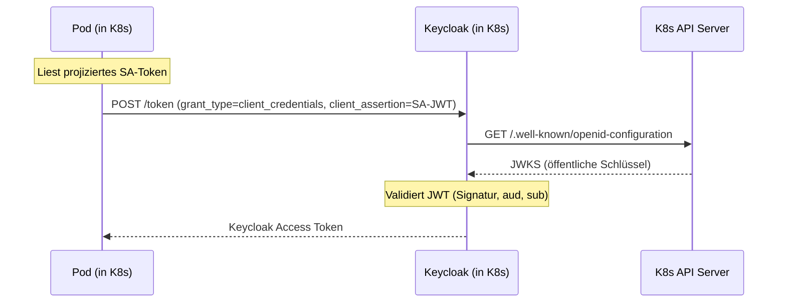
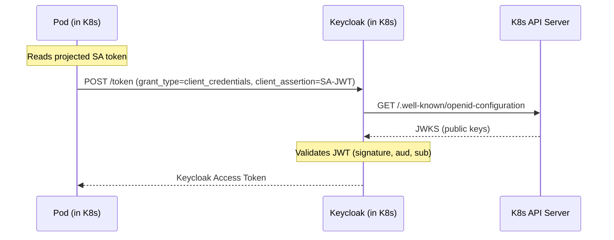

# Demo: Kubernetes Service Account Authentication

## DE

Dienste in einem Kubernetes-Cluster müssen sich häufig bei Keycloak authentifizieren, um Tokens für den Zugriff auf andere Dienste zu erhalten. Der naive Ansatz – ein statisches Client-Secret als Kubernetes-Secret verwalten – ist fehleranfällig, rotationsaufwendig und schwer zu auditieren.

Dieses Demo zeigt die moderne Alternative: Ein Pod verwendet sein **Kubernetes Service Account Token** direkt als Client-Credential bei Keycloak. Kein statisches Secret wird verteilt. Keycloak validiert das SA-Token über den Kubernetes-JWKS-Endpunkt und stellt ein Keycloak-Zugriffstoken aus.

Dies nutzt Keycloaks natives **Federated Client Authentication**-Feature (GA seit Keycloak 26.6).

### Konzept



**Keycloak konfiguriert einen Kubernetes Identity Provider**, der die öffentlichen Schlüssel vom K8s-API-Server bezieht. Der Client `workload-service` ist an den `sub`-Claim des Service Accounts gebunden (`system:serviceaccount:masterclass:demo-workload`). Kein Client-Secret wird benötigt.

Da Keycloak den K8s-JWKS-Endpunkt (`https://kubernetes.default.svc`) erreichen muss, **läuft Keycloak im selben Kubernetes-Cluster**.

### Voraussetzungen

- Lokaler Kubernetes-Cluster (z.B. [kind](https://kind.sigs.k8s.io/), [k3d](https://k3d.io/) oder [minikube](https://minikube.sigs.k8s.io/))
- `kubectl` konfiguriert und verbunden
- [Helm](https://helm.sh/) installiert
- [Terraform](https://www.terraform.io/) installiert

### Setup

1. Helm-Repo hinzufügen (falls noch nicht vorhanden):
   ```bash
   helm repo add codecentric https://codecentric.github.io/helm-charts
   helm repo update
   ```

2. Keycloak im Cluster installieren:
   ```bash
   helm install keycloak codecentric/keycloakx --values values.yaml
   ```
   > **Hinweis:** Das `values.yaml` setzt `http.relativePath: "/"`, damit Keycloak unter dem Root-Pfad erreichbar ist (Standard des codecentric-Charts ist `/auth`).

3. Warten bis der Pod läuft:
   ```bash
   kubectl get pods -w
   ```

4. Port-Forward einrichten (für Admin-UI und Terraform):
   ```bash
   kubectl port-forward svc/keycloak-keycloakx-http 8080:80
   ```
   Keycloak ist jetzt unter http://localhost:8080 erreichbar (admin / admin).

5. Den genauen Keycloak-Service-Namen im Cluster prüfen – er wird für die SA-Token-Audience benötigt:
   ```bash
   kubectl get svc | grep keycloak
   ```
   Der Standard-Name des codecentric-Charts lautet `keycloak-keycloakx-http`.

6. Den SA-Token-Issuer des Clusters ermitteln:
   ```bash
   kubectl create token default | cut -d. -f2 | base64 -d 2>/dev/null | python3 -c "import sys,json; print(json.load(sys.stdin)['iss'])"
   ```
   Der Wert entspricht dem `--service-account-issuer`-Flag des API-Servers und ist cluster-spezifisch (z.B. `https://kubernetes.default.svc.cluster.local` bei k3d/kind).

7. Kubernetes-Manifeste deployen:
   ```bash
   kubectl apply -f manifests/
   ```
   Dies erstellt die Service Accounts (`demo-workload`, `terraform`) sowie die Pods `test-pod` und `terraform-pod`.

### Terraform anwenden

Es gibt zwei Möglichkeiten, Terraform gegen Keycloak auszuführen – je nachdem, ob Keycloak bereits durch Terraform konfiguriert ist oder ob Bootstrap-Zugriff über Admin-Credentials nötig ist.

---

#### Option A: Admin-Credentials (Bootstrap)

Der Provider authentifiziert sich mit Benutzername und Passwort. Geeignet für den ersten Durchlauf, wenn noch kein Terraform-Client in Keycloak existiert.

`main.tf` Provider-Block:
```hcl
provider "keycloak" {
  client_id = "admin-cli"
  username  = "admin"
  password  = "admin"
  url       = "http://localhost:8080"
}
```

Terraform lokal ausführen (Port-Forward muss aktiv sein):
```bash
cd terraform
terraform init
terraform apply -var="kubernetes_issuer=<ISSUER>"
```

---

#### Option B: Signed JWT via Kubernetes Service Account (secretlos)

Der Provider authentifiziert sich mit dem SA-Token des `terraform`-Pods – kein statisches Secret nötig. Dies setzt voraus, dass in Keycloak bereits ein passender Client konfiguriert ist (s.u.).

**Voraussetzungen in Keycloak (manuell oder durch Option A angelegt):**

1. Im `master`-Realm einen **Kubernetes Identity Provider** anlegen:
   - *Alias:* `kubernetes`
   - *Issuer:* SA-Token-Issuer des Clusters (z.B. `https://kubernetes.default.svc.cluster.local`)

2. Einen Client `terraform` im `master`-Realm anlegen:
   - *Access Type:* Confidential, Service Accounts enabled
   - *Client Authenticator:* Federated JWT
   - *jwt.credential.issuer:* `kubernetes` (Alias des IdP)
   - *jwt.credential.sub:* `system:serviceaccount:masterclass:terraform`
   - *Service Account Roles:* Admin-Rechte zuweisen (z.B. `admin`)

3. SA-Token-Audience muss auf den `master`-Realm zeigen. In `manifests/terraform-pod.yaml` ist dies bereits korrekt gesetzt:
   ```yaml
   audience: "http://keycloak-keycloakx-http/realms/master"
   ```

`main.tf` Provider-Block:
```hcl
provider "keycloak" {
  jwt_token_file = "/var/run/secrets/serviceaccount/token"
  url            = "http://keycloak-keycloakx-http"
}
```

Terraform aus dem Pod ausführen:
```bash
# Terraform-Code in den Pod kopieren
kubectl cp terraform/ masterclass/terraform-pod:/terraform

# Shell im Pod öffnen
kubectl exec -it terraform-pod -- sh

# Terraform ausführen
terraform init
terraform apply -var="kubernetes_issuer=<ISSUER>"
```

---

### Was konfiguriert wird

| Ressource | Beschreibung |
|---|---|
| Realm `lab-realm` | Demo-Realm |
| Kubernetes Identity Provider `kubernetes` | Validiert SA-Tokens via K8s-JWKS |
| Client `workload-service` | Gebunden an `system:serviceaccount:masterclass:demo-workload` |
| ServiceAccount `demo-workload` | Kubernetes-Identität des Demo-Workloads |
| Pod `test-pod` | curl-Pod mit projiziertem SA-Token |
| ServiceAccount `terraform` | Kubernetes-Identität des Terraform-Pods |
| Pod `terraform-pod` | Terraform-Pod mit projiziertem SA-Token (Audience: master-Realm) |

### Demo-Ablauf

1. Shell in den Pod öffnen:
   ```bash
   kubectl exec -it test-pod -- sh
   ```

2. Das SA-Token anzeigen und dekodieren (zeigt `iss`, `sub`, `aud` – kein Secret):
   ```bash
   cat /var/run/secrets/serviceaccount/token
   ```
   Den Token-Wert auf [jwt.io](https://jwt.io) einfügen und die Claims betrachten:
   - `iss`: the cluster's SA token issuer (e.g. `https://kubernetes.default.svc.cluster.local`)
   - `sub`: `system:serviceaccount:masterclass:demo-workload`
   - `aud`: `http://keycloak-keycloakx-http/realms/lab-realm`

3. SA-Token gegen ein Keycloak-Zugriffstoken tauschen:
   ```bash
   curl -s \
     "http://keycloak-keycloakx-http/realms/lab-realm/protocol/openid-connect/token" \
     -H "Content-Type: application/x-www-form-urlencoded" \
     --data-urlencode "grant_type=client_credentials" \
     --data-urlencode "client_assertion_type=urn:ietf:params:oauth:client-assertion-type:jwt-bearer" \
     --data-urlencode "client_assertion=$(cat /var/run/secrets/serviceaccount/token)"
   ```

4. Das Keycloak-Zugriffstoken auf [jwt.io](https://jwt.io) dekodieren:
   - `azp`: `workload-service` – Keycloak hat den richtigen Client identifiziert
   - `iss`: `http://keycloak-keycloakx-http/realms/lab-realm`
   - Kein Benutzername, kein statisches Secret wurde verwendet

### Hinweise

- Das SA-Token läuft nach 600 Sekunden ab (Kubernetes-Minimum für projizierte Tokens: 600s, Maximum: 3600s). Der Pod erhält automatisch ein neues Token.

### Cleanup

```bash
kubectl delete -f manifests/
terraform destroy
helm uninstall keycloak
```

---

## EN

Services in a Kubernetes cluster often need to authenticate with Keycloak to obtain tokens for accessing other services. The naive approach — managing a static client secret as a Kubernetes Secret — is error-prone, rotation-heavy, and hard to audit.

This demo shows the modern alternative: a pod uses its **Kubernetes Service Account Token** directly as a client credential with Keycloak. No static secret is distributed. Keycloak validates the SA token via the Kubernetes JWKS endpoint and issues a Keycloak access token.

This leverages Keycloak's native **Federated Client Authentication** feature (GA since Keycloak 26.6).

### Concept



**Keycloak configures a Kubernetes Identity Provider** that fetches public keys from the K8s API server. The client `workload-service` is bound to the Service Account's `sub` claim (`system:serviceaccount:masterclass:demo-workload`). No client secret is needed.

Since Keycloak must reach the K8s JWKS endpoint (`https://kubernetes.default.svc`), **Keycloak runs in the same Kubernetes cluster**.

### Prerequisites

- Local Kubernetes cluster (e.g. [kind](https://kind.sigs.k8s.io/), [k3d](https://k3d.io/), or [minikube](https://minikube.sigs.k8s.io/))
- `kubectl` configured and connected
- [Helm](https://helm.sh/) installed
- [Terraform](https://www.terraform.io/) installed

### Setup

1. Add the Helm repo (if not already added):
   ```bash
   helm repo add codecentric https://codecentric.github.io/helm-charts
   helm repo update
   ```

2. Install Keycloak in the cluster:
   ```bash
   helm install keycloak codecentric/keycloakx --values values.yaml
   ```
   > **Note:** `values.yaml` sets `http.relativePath: "/"` so Keycloak is reachable at the root path (the codecentric chart defaults to `/auth`).

3. Wait for the pod to be ready:
   ```bash
   kubectl get pods -w
   ```

4. Set up port-forwarding (for the Admin UI and Terraform):
   ```bash
   kubectl port-forward svc/keycloak-keycloakx-http 8080:80
   ```
   Keycloak is now available at http://localhost:8080 (admin / admin).

5. Verify the exact Keycloak service name in the cluster — it is needed for the SA token audience:
   ```bash
   kubectl get svc | grep keycloak
   ```
   The default name for the codecentric chart is `keycloak-keycloakx-http`.

6. Discover the cluster's SA token issuer:
   ```bash
   kubectl create token default | cut -d. -f2 | base64 -d 2>/dev/null | python3 -c "import sys,json; print(json.load(sys.stdin)['iss'])"
   ```
   This reflects the API server's `--service-account-issuer` flag and is cluster-specific (e.g. `https://kubernetes.default.svc.cluster.local` on k3d/kind).

7. Deploy Kubernetes manifests:
   ```bash
   kubectl apply -f manifests/
   ```
   This creates the Service Accounts (`demo-workload`, `terraform`) and the pods `test-pod` and `terraform-pod`.

### Applying Terraform

There are two ways to run Terraform against Keycloak — depending on whether Keycloak is already configured or whether bootstrap access via admin credentials is needed.

---

#### Option A: Admin Credentials (Bootstrap)

The provider authenticates with username and password. Suitable for the first run when no Terraform client exists in Keycloak yet.

`main.tf` provider block:
```hcl
provider "keycloak" {
  client_id = "admin-cli"
  username  = "admin"
  password  = "admin"
  url       = "http://localhost:8080"
}
```

Run Terraform locally (port-forward must be active):
```bash
cd terraform
terraform init
terraform apply -var="kubernetes_issuer=<ISSUER>"
```

---

#### Option B: Signed JWT via Kubernetes Service Account (secretless)

The provider authenticates using the SA token of the `terraform` pod — no static secret needed. This requires a matching client to already be configured in Keycloak (see below).

**Prerequisites in Keycloak (set up manually or via Option A):**

1. Create a **Kubernetes Identity Provider** in the `master` realm:
   - *Alias:* `kubernetes`
   - *Issuer:* the cluster's SA token issuer (e.g. `https://kubernetes.default.svc.cluster.local`)

2. Create a client `terraform` in the `master` realm:
   - *Access Type:* Confidential, Service Accounts enabled
   - *Client Authenticator:* Federated JWT
   - *jwt.credential.issuer:* `kubernetes` (alias of the IdP above)
   - *jwt.credential.sub:* `system:serviceaccount:masterclass:terraform`
   - *Service Account Roles:* assign admin permissions (e.g. `admin`)

3. The SA token audience must point to the `master` realm. This is already set correctly in `manifests/terraform-pod.yaml`:
   ```yaml
   audience: "http://keycloak-keycloakx-http/realms/master"
   ```

`main.tf` provider block:
```hcl
provider "keycloak" {
  jwt_token_file = "/var/run/secrets/serviceaccount/token"
  url            = "http://keycloak-keycloakx-http"
}
```

Run Terraform from inside the pod:
```bash
# Copy Terraform code into the pod
kubectl cp terraform/ masterclass/terraform-pod:/terraform

# Open a shell in the pod
kubectl exec -it terraform-pod -- sh

# Run Terraform
terraform init
terraform apply -var="kubernetes_issuer=<ISSUER>"
```

---

### What gets configured

| Resource | Description |
|---|---|
| Realm `lab-realm` | Demo realm |
| Kubernetes Identity Provider `kubernetes` | Validates SA tokens via K8s JWKS |
| Client `workload-service` | Bound to `system:serviceaccount:masterclass:demo-workload` |
| ServiceAccount `demo-workload` | Kubernetes identity of the demo workload |
| Pod `test-pod` | curl pod with projected SA token |
| ServiceAccount `terraform` | Kubernetes identity of the Terraform pod |
| Pod `terraform-pod` | Terraform pod with projected SA token (audience: master realm) |

### Demo walkthrough

1. Open a shell in the pod:
   ```bash
   kubectl exec -it test-pod -- sh
   ```

2. Display and decode the SA token (shows `iss`, `sub`, `aud` — no secret):
   ```bash
   cat /var/run/secrets/serviceaccount/token
   ```
   Paste the token value into [jwt.io](https://jwt.io) and inspect the claims:
   - `iss`: the cluster's SA token issuer (e.g. `https://kubernetes.default.svc.cluster.local`)
   - `sub`: `system:serviceaccount:masterclass:demo-workload`
   - `aud`: `http://keycloak-keycloakx-http/realms/lab-realm`

3. Exchange the SA token for a Keycloak access token:
   ```bash
   curl -s \
     "http://keycloak-keycloakx-http/realms/lab-realm/protocol/openid-connect/token" \
     -H "Content-Type: application/x-www-form-urlencoded" \
     --data-urlencode "grant_type=client_credentials" \
     --data-urlencode "client_assertion_type=urn:ietf:params:oauth:client-assertion-type:jwt-bearer" \
     --data-urlencode "client_assertion=$(cat /var/run/secrets/serviceaccount/token)"
   ```

4. Decode the Keycloak access token at [jwt.io](https://jwt.io):
   - `azp`: `workload-service` — Keycloak identified the correct client
   - `iss`: `http://keycloak-keycloakx-http/realms/lab-realm`
   - No username, no static secret was involved

### Notes

- The SA token expires after 600 seconds (Kubernetes minimum for projected tokens: 600s, maximum: 3600s). The pod automatically receives a refreshed token.

### Cleanup

```bash
kubectl delete -f manifests/
terraform destroy
helm uninstall keycloak
```
