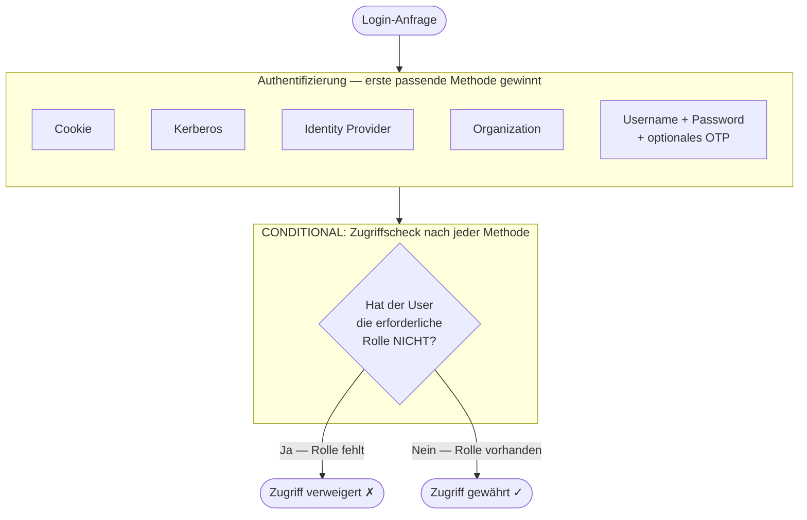
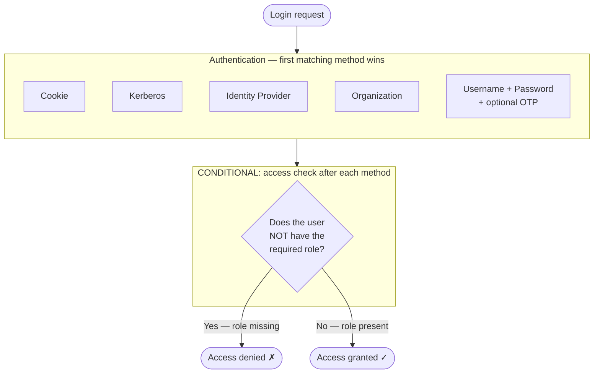

# Demo: Role-Based Client Access

## DE

Keycloak bietet keine native Unterstützung dafür, den Login zu einem bestimmten Client auf Benutzer mit einer bestimmten Rolle zu beschränken. Dieses Demo zeigt einen Workaround: Für jeden Client wird ein eigener Browser-Flow erstellt, der nach der Authentifizierung prüft, ob der Benutzer die erforderliche Rolle besitzt – andernfalls wird der Zugriff verweigert.

### Konzept

Der Standard-Browser-Flow wird pro Client nachgebaut und um eine rollenbasierte Zugriffsprüfung erweitert. Jede Authentifizierungsmethode (Cookie, Kerberos, Identity Provider, Organization, Username/Password) erhält einen eigenen Subflow mit einem nachgelagerten CONDITIONAL-Subflow, der Folgendes prüft:

- Hat der Benutzer **nicht** eine der erlaubten Rollen? → Zugriff verweigern (`deny-access-authenticator`)

Die Logik der Rollenbedingung ist invertiert (negiert): Die Condition prüft, ob der Benutzer die Rolle **nicht** hat, und blockiert in diesem Fall den Zugang.

### Struktur des generierten Browser-Flows

Das Muster ist für jede Authentifizierungsmethode identisch: Nach erfolgreicher Authentifizierung prüft ein CONDITIONAL-Subflow, ob die erforderliche Rolle **fehlt** — und verweigert in diesem Fall den Zugriff.



### Setup

**Voraussetzungen:** Docker, Terraform

1. Keycloak starten:
   ```bash
   docker compose up -d
   ```
   Keycloak ist unter http://localhost:8080 erreichbar (admin / admin).

2. Terraform initialisieren und anwenden:
   ```bash
   cd terraform
   terraform init
   terraform apply
   ```
   Terraform legt den Realm `lab-realm`, die Clients `outline` und `nextcloud`, die Rollen `outline.access` / `nextcloud.access` sowie die jeweiligen Browser-Flows an und weist diese den Clients zu.

3. Testbenutzer (`testuser` / `testuser`) ist vorhanden, aber hat noch keine Client-Rollen zugewiesen bekommen.

### Demo-Ablauf

1. Öffne http://localhost:8082 (Outline) und versuche dich als `testuser` einzuloggen → Zugriff wird verweigert.
2. Weise dem `testuser` in der Admin Console die die Rolle `access` des Clients `outline` zu.
3. Logge dich erneut ein → Zugriff gewährt.
4. Öffne http://localhost:8081 (Nextcloud) → Zugriff wird verweigert, da `testuser` die Rolle `access` des Clients `nextcloud` nicht hat.
5. Weise auch die Client Role `access` von `nextcloud` zu und teste erneut.

### Terraform-Modul

Das wiederverwendbare Modul unter `terraform/modules/client-access-flow/` generiert den vollständigen Browser-Flow für einen beliebigen Client:

```hcl
module "my_app_flow" {
  source        = "./modules/client-access-flow"
  realm_id      = keycloak_realm.lab.id
  client_id     = "my-app"
  allowed_roles = ["my-app.access"]
}
```

---

## EN

Keycloak does not natively support restricting login to a specific client based on a user's role. This demo shows a workaround: a dedicated browser flow is created per client that checks, after authentication, whether the user holds the required role — otherwise access is denied.

### Concept

The default browser flow is replicated per client and extended with a role-based access check. Each authentication method (Cookie, Kerberos, Identity Provider, Organization, Username/Password) gets its own subflow with a trailing CONDITIONAL subflow that checks:

- Does the user **not** have one of the allowed roles? → Deny access (`deny-access-authenticator`)

The role condition logic is inverted (negated): the condition checks whether the user does **not** have the role, blocking access in that case.

### Structure of the generated browser flow

The pattern is identical for every authentication method: after successful authentication, a CONDITIONAL subflow checks whether the required role is **missing** — and denies access if so.



### Setup

**Prerequisites:** Docker, Terraform

1. Start Keycloak:
   ```bash
   docker compose up -d
   ```
   Keycloak is available at http://localhost:8080 (admin / admin).

2. Initialize and apply Terraform:
   ```bash
   cd terraform
   terraform init
   terraform apply
   ```
   Terraform creates the realm `lab-realm`, clients `outline` and `nextcloud`, roles `outline.access` / `nextcloud.access`, and the browser flows, then binds each flow to its client.

3. A test user (`testuser` / `testuser`) is created but has no client roles assigned yet.

### Demo walkthrough

1. Open http://localhost:8082 (Outline) and try to log in as `testuser` → access is denied.
2. Assign the role `access` of client `outline` to `testuser` in the Admin Console.
3. Log in again → access granted.
4. Open http://localhost:8081 (Nextcloud) → access is denied because `testuser` does not have the role `access` of client `nextcloud`.
5. Assign the client role `access` of `nextcloud` as well and test again.

### Terraform module

The reusable module at `terraform/modules/client-access-flow/` generates the complete browser flow for any client:

```hcl
module "my_app_flow" {
  source        = "./modules/client-access-flow"
  realm_id      = keycloak_realm.lab.id
  client_id     = "my-app"
  allowed_roles = ["my-app.access"]
}
```
